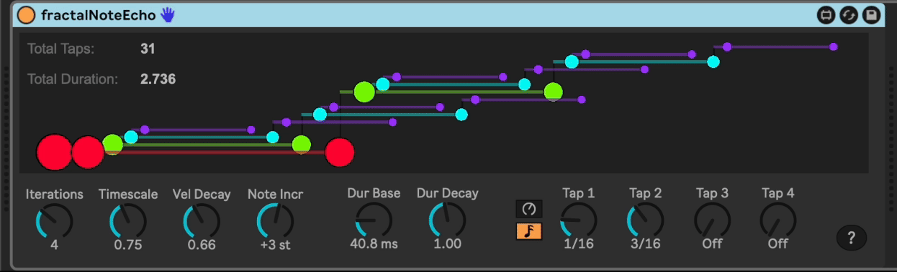
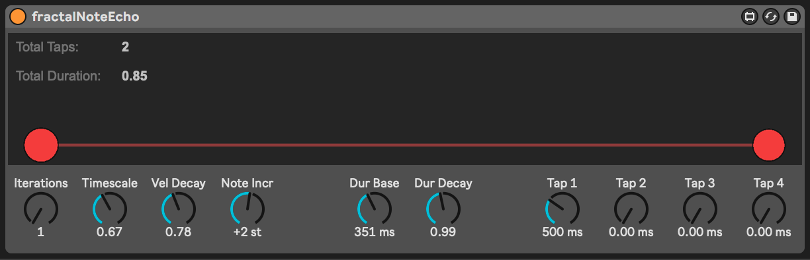
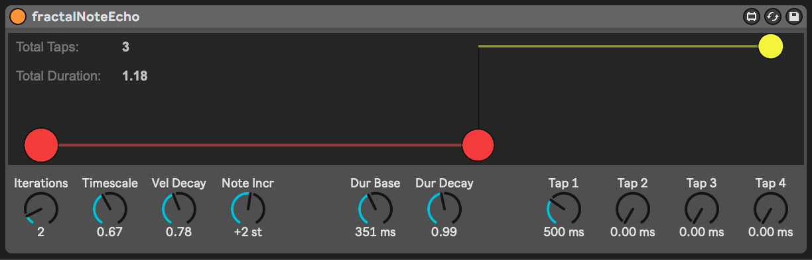
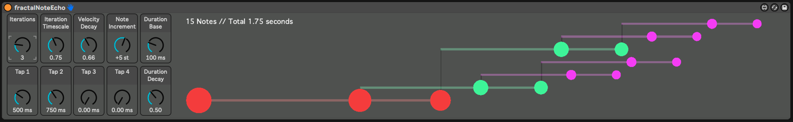
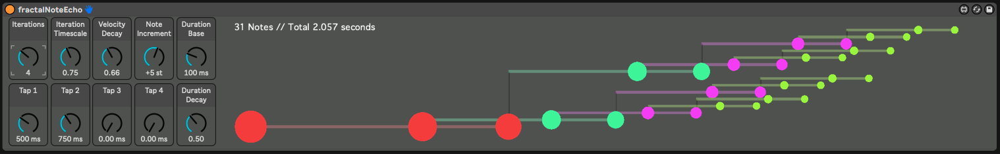
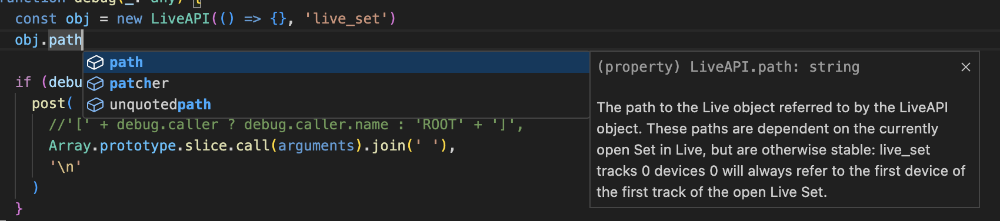
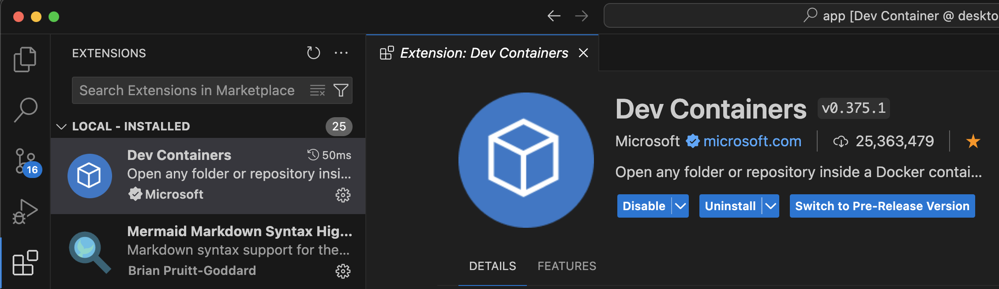
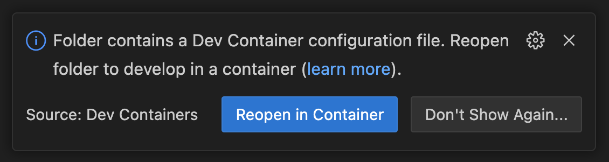

# m4l-js-fractalNoteEcho

This Max For Live device uses Javascript to implement a fractal MIDI note echo effect.

This allows for easy creation of very complex patterns that, due to their nature in following a scaled pattern, tend to be pleasant to listen to and can inspire creativity you didn't know you had.



## Installation / Setup

If you just want to download and install the device, then go to the [frozen/](https://github.com/zsteinkamp/m4l-js-fractalNoteEcho/tree/main/frozen) directory and download the newest version there.

### Changelog

- [3](https://github.com/zsteinkamp/m4l-js-fractalNoteEcho/raw/main/frozen/FractalNoteEcho-3.amxd) - 2023-07-09 - Add tempo-synced time mode option.
- [0.0.2](https://github.com/zsteinkamp/m4l-js-fractalNoteEcho/raw/main/frozen/FractalNoteEcho-0.0.2.amxd) - 2022-06-07 - Improved look and feel.
- [0.0.1](https://github.com/zsteinkamp/m4l-js-fractalNoteEcho/raw/main/frozen/FractalNoteEcho-0.0.1.amxd) - 2022-05-19 - Initial frozen release.

## What is a fractal MIDI note echo effect you ask?

Well, it's a device that sends note echoes, but each echo follows the rules of fractals. Before we get into the fractal part, understand first how you set up your base echo pattern.

A base set of echo taps is defined using four knobs. Each echo tap has its own delay, in milliseconds. This sets up a basic echo pattern. Each note received will result in N notes output, each delayed by the specified amount (use zero to disable).

Here is a picture of a simple example, using a single echo tap:



You can see the initial note as the circle on the left side, and the resulting echo played on the right. The distance between the circles is the tap time, in milliseconds.

Now here is where the fractals come in. If you increase the `Iterations` value from 1 to 2, then the fractal will be iterated. The `Stretch` parameter controls the scaling between iterations. In this example, the value is `0.75`, so each iteration will be smaller than the previous one. You can see now a second echo has been created, starting from the first, but scaled down to 75% of the original.



If you add a tap to this and keep Iterations set to 2, now you start to get something that looks more interesting. Each tap is the beginning of the next iteration.


Turning Iterations up to 3 gives a much more complex result. Notice each iteration is 75% as large as the prior one.



And finally turning Iterations up to 4 more than doubles the number of notes, and gives even more complexity.



Along with four taps and iterations, there are controls for velocity decay, note length, note length decay, and iteration note offset. With the note offset, the layers of iterations (the different colors in the diagrams above) can trigger different MIDI notes -- either slices of a sample or to form intersting chordal patterns.

## About the Code

This is the first thing I've done in Javascript with Max For Live, and I'm in love! I have struggled to make peace with M4L's mindset, so this let's the programmer in me really come out.

## Ideas

---

# m4l-typescript-base

Provides a starting point for a Typescript-based development environment for Max for Live projects that use Javascript objects like `js` and `jsui`. Uses Docker and VSCode devcontainer for the heavy lifting, thus eliminating the need to manage a build toolchain on your dev machine.

Since it uses `types/maxforlive`, you can have good completion and parameter documentation for Max for Live Javascript objects.



The container mounts the repo directory from the host read-write, and runs `tsc watch`, looking for changes in the `src/` directory. Any changes to `*.ts` files in the `src/` directory are built and transpiled to `Project/*.js`.

## Getting Started

- Install [Docker Desktop](https://www.docker.com/products/docker-desktop/) and [VSCode](https://code.visualstudio.com/download) on your dev machine
- Ensure the Dev Containers extension is added to VSCode
  
- Fork this repo
- Clone the forked repo to your dev machine
- `cd` into the repo directory and run:
  `code .`
- This will open VSCode. It should prompt you to "Reopen in Container" once open. Click this to build the container (including installing dependencies listed in `yarn.lock`)



- The window will reload.
- You now have a container running that has a full node.js/Typescript development toolkit, with your repo source directory mounted read/write. This frees you from having to manage multiple toolchains on your development machine, which may or may not be out of date or out of sync with your fellow developers or repo requirements.

  - For example, to add a package with `yarn` you can Cmd-J from inside of VSCode and run the command. If you add a package, then the `package.json` and `yarn.lock` files are also updated, which you can then check to source control.


- At this point, you can add the `Project/Device.amxd` file to your Live Set.
- If you right click the title of the device and choose "Show Max Window", you should see a line from the device indicating that it was reloaded.


- You can now edit the device in Max, and edit the code in `src/index.ts` in VSCode, and the device will auto-update `Project/index.js`.

### Creating new source files

If you want to create more source files, simply add a `*.ts` file to the `src/` directory to the project. As soon as you save it, it will be transpiled to `.js` and saved in the `Project/` directory.

### Adding npm dependencies

In VSCode, press `Cmd-J` to open a shell inside the container. From there, you can run normal `yarn` commands to manage packages, e.g.

```
# yarn add concurrently --dev
```

This will update the `package.json` and `yarn.lock` files, which you can then commit.

### Deleting Source Files

If you delete a `src/*.ts` file, you will need to manually delete the `js` file from the `Project/` directory. You can do this either on the host directly (e.g. in the Finder/Explorer, or in a Terminal window) or from within VSCode (e.g. via `rm` in the Cmd-J shell window or by right-clicking the file in the Explorer and choosing "Delete Permanently").

## TODOs

...
