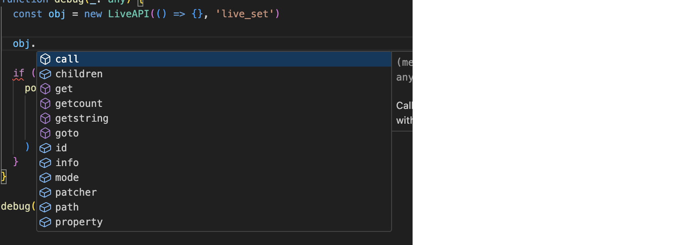

# m4l-typescript-base

Provides a starting point for a Typescript-based development environment for Max for Live projects that use Javascript objects like `js` and `jsui`. Uses Docker and VSCode devcontainer for the heavy lifting, thus eliminating the need to manage a build toolchain on your dev machine.

Since it uses `types/maxforlive`, you can have good completion and parameter documentation for Max for Live Javascript objects.




The container mounts the repo directory from the host read-write, and runs `tsc watch`, looking for changes in the `src/` directory. Any changes to `*.ts` files in the `src/` directory are built and transpiled to `Project/*.js`.

## Getting Started

- Install [Docker Desktop](https://www.docker.com/products/docker-desktop/) and [VSCode](https://code.visualstudio.com/download) on your dev machine
- Ensure the Dev Containers extension is added to VSCode
  
- Fork this repo
- Clone the forked repo to your dev machine
- `cd` into the repo directory and run:
  `code .`
- This will open VSCode. It should prompt you to "Reopen in Container" once open. Click this to build the container (including installing dependencies listed in `yarn.lock`)


- The window will reload.
- You now have a container running that has a full node.js/Typescript development toolkit, with your repo source directory mounted read/write. This frees you from having to manage multiple toolchains on your development machine, which may or may not be out of date or out of sync with your fellow developers or repo requirements.

  - For example, to add a package with `yarn` you can Cmd-J from inside of VSCode and run the command. If you add a package, then the `package.json` and `yarn.lock` files are also updated, which you can then check to source control.


- At this point, you can add the `Project/Device.amxd` file to your Live Set.
- If you right click the title of the device and choose "Show Max Window", you should see a line from the device indicating that it was reloaded.


- You can now edit the device in Max, and edit the code in `src/index.ts` in VSCode, and the device will auto-update `Project/index.js`.

### Creating new source files

If you want to create more source files, simply add a `*.ts` file to the `src/` directory to the project. As soon as you save it, it will be transpiled to `.js` and saved in the `Project/` directory.

### Adding npm dependencies

In VSCode, press `Cmd-J` to open a shell inside the container. From there, you can run normal `yarn` commands to manage packages, e.g.

```
# yarn add concurrently --dev
```

This will update the `package.json` and `yarn.lock` files, which you can then commit.

### Deleting Source Files

If you delete a `src/*.ts` file, you will need to manually delete the `js` file from the `Project/` directory. You can do this either on the host directly (e.g. in the Finder/Explorer, or in a Terminal window) or from within VSCode (e.g. via `rm` in the Cmd-J shell window or by right-clicking the file in the Explorer and choosing "Delete Permanently").

## TODOs

- ...
