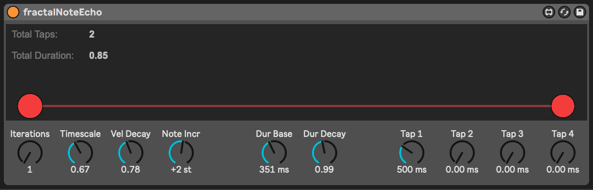
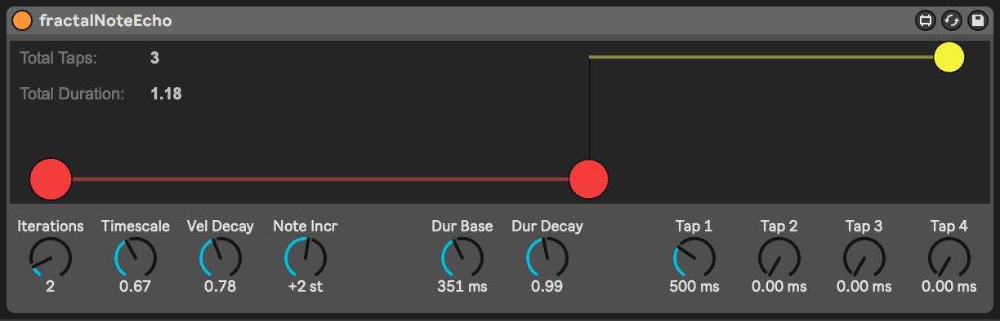
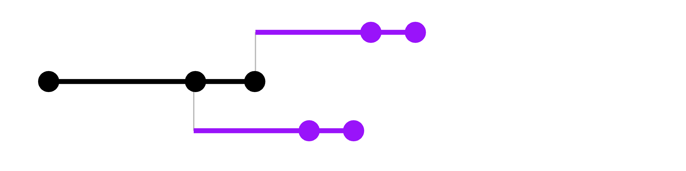
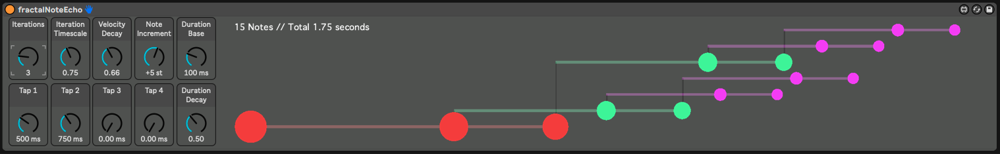
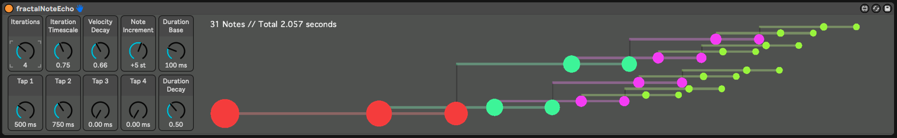

# m4l-js-fractalNoteEcho

This Max For Live device uses Javascript to implement a fractal MIDI note echo effect.

This allows for easy creation of very complex patterns that, due to their nature in following a scaled pattern, tend to be pleasant to listen to and can inspire creativity you didn't know you had.

Here is an [example of a song](https://zacksteinkamp.bandcamp.com/track/two-trees) I put together.

## Installation / Setup

If you just want to download and install the device, then go to the [frozen/](https://github.com/zsteinkamp/m4l-js-fractalNoteEcho/tree/main/frozen) directory and download the newest version there.

### Changelog

* [0.0.2](https://github.com/zsteinkamp/m4l-js-fractalNoteEcho/raw/main/frozen/FractalNoteEcho-0.0.2.amxd) - 2022-06-07 - Improved look and feel.
* [0.0.1](https://github.com/zsteinkamp/m4l-js-fractalNoteEcho/raw/main/frozen/FractalNoteEcho-0.0.1.amxd) - 2022-05-19 - Initial frozen release.

## What is a fractal MIDI note echo effect you ask?

Well, it's a device that sends note echoes, but each echo follows the rules of fractals. Before we get into the fractal part, understand first how you set up your base echo pattern.

A base set of echo taps is defined using four knobs. Each echo tap has its own delay, in milliseconds. This sets up a basic echo pattern. Each note received will result in N notes output, each delayed by the specified amount (use zero to disable).

Here is a picture of a simple example, using a single echo tap:

You can see the initial note as the circle on the left side, and the resulting echo played on the right. The distance between the circles is the tap time, in milliseconds.

Now here is where the fractals come in. If you increase the `Iterations` value from 1 to 2, then the fractal will be iterated. The `Stretch` parameter controls the scaling between iterations. In this example, the value is `0.75`, so each iteration will be smaller than the previous one. You can see now a second echo has been created, starting from the first, but scaled down to 75% of the original.

If you add a tap to this and keep Iterations set to 2, now you start to get something that looks more interesting. Each tap is the beginning of the next iteration.

Turning Iterations up to 3 gives a much more complex result. Notice each iteration is 75% as large as the prior one.

And finally turning Iterations up to 4 more than doubles the number of notes, and gives even more complexity.

Along with four taps and iterations, there are controls for velocity decay, note length, note length decay, and iteration note offset. With the note offset, the layers of iterations (the different colors in the diagrams above) can trigger different MIDI notes -- either slices of a sample or to form intersting chordal patterns.

## About the Code

This is the first thing I've done in Javascript with Max For Live, and I'm in love! I have struggled to make peace with M4L's mindset, so this lets the programmer in me really come out.
